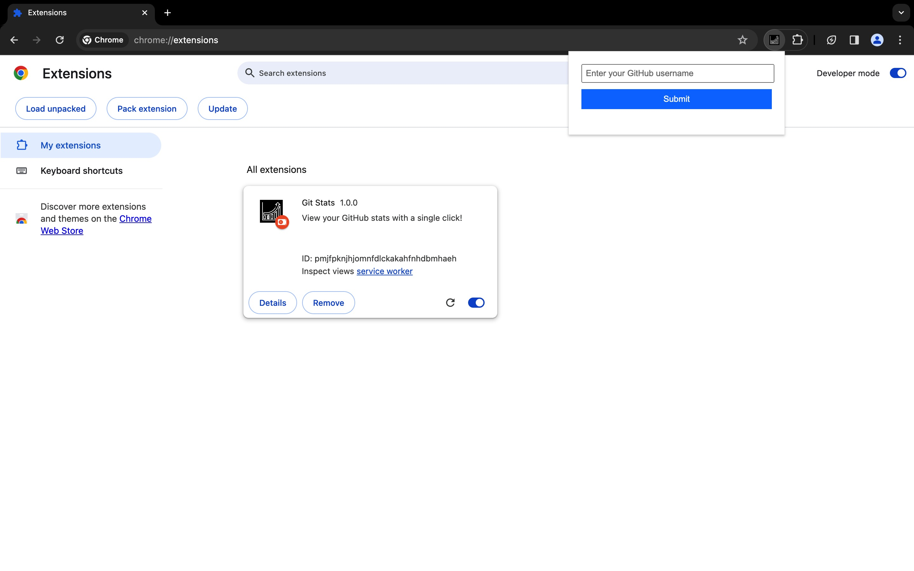
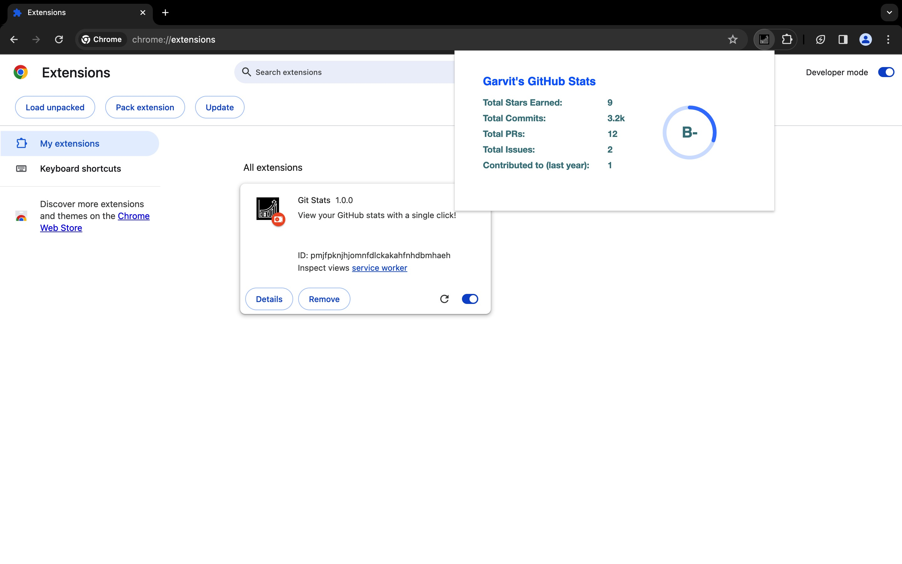

# GitHub Stats Chrome Extension

## Overview

The GitHub Stats Chrome Extension is a convenient tool that allows users to quickly view their GitHub statistics directly from their browser toolbar. With just a click, users can see an image representation of their GitHub stats, including metrics like contributions, repositories, and more.

## Features

- **Instant Access**: Simply click on the extension icon to view your GitHub stats without leaving your current tab.
- **Customizable Themes**: Choose from a variety of themes to personalize the appearance of your stats image.
- **Persistent Username**: Enter your GitHub username once, and the extension will remember it for future use.
- **Sleek UI**: Enjoy a clean and intuitive user interface for seamless interaction.

## Installation

1. Clone or download the repository to your local machine.
2. Open Google Chrome and navigate to `chrome://extensions/`.
3. Enable **Developer mode** in the top right corner.
4. Click on **Load unpacked** and select the folder containing the extension files.

## Usage

1. Click on the GitHub Stats Chrome Extension icon in your browser toolbar.
2. If it's your first time using the extension, enter your GitHub username when prompted.
3. Enjoy instant access to your GitHub stats image right in the popup!

## Screenshots

## Feedback

We welcome any feedback or suggestions for improving the GitHub Stats Chrome Extension. Feel free to [open an issue](https://github.com/garvit-exe/github-stats-chrome-extension/issues) on GitHub.

## License

This project is licensed under the MIT License - see the [LICENSE](LICENSE) file for details.
